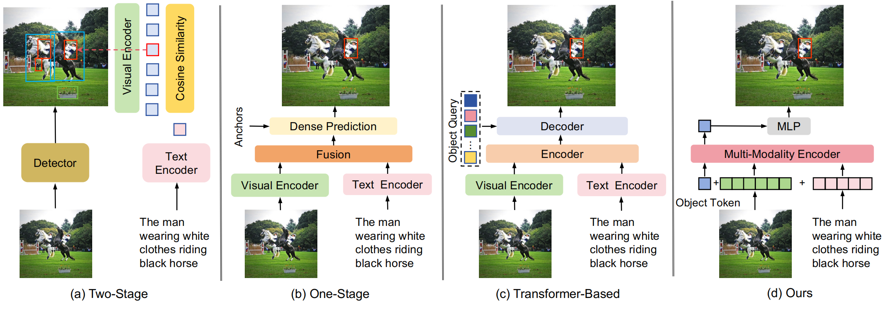
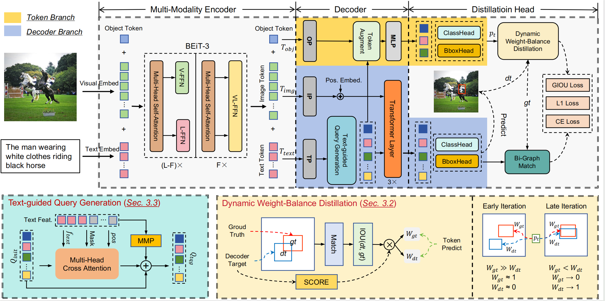

# SimVG: A Simple Framework for Visual Grounding with Decoupled Multi-modal Fusion

[Ming Dai](https://dmmm1997.github.io/), Lingfeng Yang, Yihao Xu, [Zhenhua Feng](https://scholar.google.com/citations?hl=zh-CN&user=Y6KtijIAAAAJ), [Wankou Yang*](https://automation.seu.edu.cn/ywk/main.psp)

SouthEast University

<a href='https://arxiv.org/pdf/2409.17531'></a>

[](https://paperswithcode.com/sota/generalized-referring-expression?p=simvg-a-simple-framework-for-visual-grounding)

[](https://paperswithcode.com/sota/referring-expression-comprehension-on-refcoco?p=simvg-a-simple-framework-for-visual-grounding)

[](https://paperswithcode.com/sota/referring-expression-comprehension-on-refcoco-1?p=simvg-a-simple-framework-for-visual-grounding)

[](https://paperswithcode.com/sota/referring-expression-comprehension-on-1?p=simvg-a-simple-framework-for-visual-grounding)

[](https://paperswithcode.com/sota/referring-expression-comprehension-on?p=simvg-a-simple-framework-for-visual-grounding)

## Updates

- **2024.09.26: Our work has been accepted by NeurIPS 2024.**
- **2024.10.13: The code and model are released.**

## Abstract

Visual grounding is a common vision task that involves grounding descriptive sentences to the corresponding regions of an image. Most existing methods use independent image-text encoding and apply complex hand-crafted modules or encoder-decoder architectures for modal interaction and query reasoning. However, their performance significantly drops when dealing with complex textual expressions. This is because the former paradigm only utilizes limited downstream data to fit the multi-modal feature fusion. Therefore, it is only effective when the textual expressions are relatively simple. In contrast, given the wide diversity of textual expressions and the uniqueness of downstream training data, the existing fusion module, which extracts multimodal content from a visual-linguistic context, has not been fully investigated. In this paper, we present a simple yet robust transformer-based framework, SimVG, for visual grounding. Specifically, we decouple visual-linguistic feature fusion from downstream tasks by leveraging existing multimodal pre-trained models and incorporating additional object tokens to facilitate deep integration of downstream and pre-training tasks. Furthermore, we design a dynamic weight-balance distillation method in the multi-branch synchronous learning process to enhance the representation capability of the simpler branch. This branch only consists of a lightweight MLP, which simplifies the structure and improves reasoning speed. Experiments on six widely used VG datasets, \textit{i.e.}, RefCOCO/+/g, ReferIt, Flickr30K, and GRefCOCO, demonstrate the superiority of SimVG. Finally, the proposed method not only achieves improvements in efficiency and convergence speed but also attains new state-of-the-art performance on these benchmarks.


## FrameWork


<!--    -->
  
  
<!--  
 
  -->


<!-- This is the official implementation of [SimVG: A Simple Framework for Visual Grounding with Decoupled Multi-modal Fusion](https://arxiv.org/pdf/2409.17531), which simplifies and unifies the modelling for visual grounding tasks under a novel point prediction paradigm.  -->

<!-- To this end, different grounding tasks can be tackled in one network with the simple cross-entropy loss. We surpass or maintain on par with state-of-the-arts, and also outperform a set of larget-scale pre-trained models with much less expenditure, suggesting a simple and universal approach is indeed feasible. -->


## Installation

### Prerequisites

```
pip install -r requirements.txt
```
Our code depends on parts of [detrex](https://detrex.readthedocs.io/en/latest/tutorials/Installation.html) and [detectron2](https://github.com/facebookresearch/detectron2), so you need to install and compile them.
```
python -m pip install 'git+https://github.com/facebookresearch/detectron2.git'
git clone https://github.com/IDEA-Research/detrex.git
cd detrex
git submodule init
git submodule update
pip install -e .
```
Then install SimVG package in editable mode:
```
pip install -e .
```

### Data Preparation

For the construction of the dataset (flickr30k, referit, refercoco/+/g), please refer to the [SeqTR](https://github.com/seanzhuh/SeqTR) repository. For the construction of the grefcoco dataset, please refer to the [GREC](https://github.com/henghuiding/gRefCOCO) repository. In addition, we provide a converted version of the grefcoco dataset [here](https://seunic-my.sharepoint.cn/:f:/g/personal/230238525_seu_edu_cn/EiX51qGWa9BBlt3fVRwgPhsBUxOIZ-yW3Hm7VXOQ3c2Ipw?e=M12MM6).


The data structure should look like the following:
```
| -- data
| -- annotations
    | -- flickr30k
    | -- referitgame-berkeley
    | -- refcoco-unc
    | -- refcocoplus-unc
    | -- refcocog-umd
    | -- refcocog-google
    | -- grefcoco
        | -- instances.json
    | -- mixed
| -- images
    | -- mscoco
    | -- saiaprtc12
    | -- flickr30k
    | -- visual-genome
```

### Pre-trained Weights

`SimVG` utilizes the [BEiT-3](https://github.com/microsoft/unilm/blob/master/beit3/README.md) model as both the backbone and the multi-modality fusion module. The pre-trained weights can be downloaded from [this link](https://github.com/microsoft/unilm/blob/master/beit3/README.md#download-checkpoints). Additionally, you will need to download the [tokenizer](https://github.com/microsoft/unilm/blob/master/beit3/README.md#text-tokenizer) for BEiT-3.

First, create a directory for the pre-trained weights:

```
mkdir pretrain_weights
```
Place the BEiT checkpoints and tokenizer within this directory.

The final directory structure of SimVG should resemble the following:
```
SimVG
├── configs
├── data
├── docs
├── pretrain_weights
├── simvg
└── tools
```

## Training

We train SimVG on a single RTX3090 GPU with 24 GB memory. The following script performs the training:

### Sinlge Task Training

#### One-Stage Distillation
In this setting, you can complete both training decoder branch (DB) and distill the token branch (TB) in one training process.
```
python tools/train.py configs/simvg/single/ViT-base/[DATASET_NAME]/[DATASET_NAME]_onestage.py
```
[DATASET_NAME] is one of "flickr30k", "referit", "refcoco", "refcocoplus", "refcocog", and "refcocoggoogle".

#### Two-Stage Distillation
This setting can further improve the performance of model. But you should complete it with more training time. And you should firstly train decoder branch.
```
python tools/train.py configs/simvg/single/ViT-base/[DATASET_NAME]/[DATASET_NAME]_twostage_1.py
```
Then load the weight to distill the TB branch.
```
python tools/train.py configs/simvg/single/ViT-base/[DATASET_NAME]/[DATASET_NAME]_twostage_2.py --load-from <pth/of/stage1>
```
You can select to add the "--load-from" option or change the "load-from" setting in the config file.

## Pre-training + fine-tuning / distillation

### Pre-training
We pre-train SimVG on 8 RTX3090 GPUs with 24 GB memory.

For pre-training all flickr30k/referit/refcoco/+/g mix datasets(174K images):
```
bash tools/dist_train.sh configs/simvg/mix/ViT-base/pretrian-mixed.py 8
```
For pre-training refcoco/+/g cocoall dataset(28K images):
```
bash tools/dist_train.sh configs/simvg/mix/ViT-base/pretrain-cocoall.py 8
```

### Fine-tuning
We finetune SimVG on 1 RTX3090 GPUs with 24GB memory.

For finetuning with the model pretrained in mix datasets (174K images).
```
python tools/train.py configs/simvg/mix/ViT-base/finetune_mix/noema#finetune#[[DATASET_NAME]].py --load-from <pth/of/pretrian-mixed>
```

For finetuning with the model pretrained in coocall datasets (28K images).
```
python tools/train.py configs/simvg/mix/ViT-base/finetune_coco_all/noema#finetune#[[DATASET_NAME]].py --load-from <pth/of/pretrain-cocoall>
```

### Two-stage distillation
Fine-tuning only further improve the decoder branch performance, if you want to use the simple token branch, you can select this mode to distill the model.

For distilling with the model pretrained in mix datasets (174K images).
```
python tools/train.py configs/simvg/mix/ViT-base/two-stage_distill_mix/noema#finetune#[[DATASET_NAME]].py --load-from <pth/of/pretrian-mixed>
```

For distilling with the model pretrained in coocall datasets (28K images).
```
python tools/train.py configs/simvg/mix/ViT-base/two-stage_distill_coco_all/noema#finetune#[[DATASET_NAME]].py --load-from <pth/of/pretrain-cocoall>
```

## Evaluation

You can use the following instruction for testing all type of models.

```
python tools/test.py [PATH_TO_CONFIG_FILE] --load-from [PATH_TO_CHECKPOINT_FILE]
```


## Models

### RefCOCO

<table>
<tr>
<td></td><td align="center">val</td><td align="center">testA</td><td align="center">testB</td><td align="center">url</td>
</tr>
<td>SimVG(ViT-L/32, DB)</td><td align="center">90.51</td><td align="center">92.37</td><td align="center">87.07</td><td align="center"><a href="https://seunic-my.sharepoint.cn/:f:/g/personal/230238525_seu_edu_cn/EmbBCACFjlNEmiMPvncu0AIByfFoeXw9zNmq3shZqtZW2g?e=xkjb3p">model & log</a></td>
</tr>
<tr>
<td>SimVG(ViT-L/32, refcocoallpretrain, two-stage distillation, TB)</td><td align="center">92.99</td><td align="center">94.86</td><td align="center">90.12</td><td align="center"><a href="">refcoco</a></td>
</tr>
</table>

### RefCOCO+

<table>
<tr>
<td></td><td align="center">val</td><td align="center">testA</td><td align="center">testB</td><td align="center">url</td>
</tr>
<tr>
<td>SimVG(ViT-L/32, DB)</td><td align="center">84.88</td><td align="center">88.50</td><td align="center">78.66</td><td align="center"><a href="https://seunic-my.sharepoint.cn/:f:/g/personal/230238525_seu_edu_cn/EgXj45WDx59LjNuVuaFUj1UBKd16IzetU0Pc0-1kcDLyAw?e=8tNNoO">model & log</a></td>
</tr>
<tr>
<td>SimVG(ViT-L/32, refcocoallpretrain, two-stage distillation, TB)</td><td align="center">87.43</td><td align="center">91.02</td><td align="center">82.10</td><td align="center"><a href="">model & log</a></td>
</tr>
</table>

### RefCOCOg

<table>
<tr>
<td></td><td align="center">val-g</td><td align="center">url</td><td align="center">val-u</td><td align="center">test-u</td><td align="center">url</td>
</tr>
<tr>
<td>SimVG(ViT-L/32, DB)</td><td align="center">80.42</td><td align="center">-</td><td align="center">85.72</td><td align="center">86.70</td><td align="center"><a href="https://seunic-my.sharepoint.cn/:f:/g/personal/230238525_seu_edu_cn/EpQVFzJfPntCr_zEoqboy9MBCpEutyy0rRbTyY2erZYiaA?e=UMRqXC">model & log</a></td>
</tr>
<tr>
<td>SimVG(ViT-L/32, refcocoallpretrain, two-stage distillation, TB)</td><td align="center">-</td><td align="center"><a href="">model & log</a></td><td align="center">87.99</td><td align="center">89.15</td><td align="center"><a href="">model & log</a></td>
</tr>

</table>


### Flickr30k & ReferIt

<table>
<tr>
<td></td><td align="center">flickr30k</td><td align="center">url</td><td align="center">referit</td><td align="center">url</td>
</tr>
<tr>
<td>SimVG(ViT-L/32, DB)</td><td align="center">78.75</td><td align="center"><a href="https://seunic-my.sharepoint.cn/:f:/g/personal/230238525_seu_edu_cn/EjtctAt7fGdGjzYUH0ZjKZsBNcHcz_pko3vfvNGFRpzLxw?e=N3qeMH">model & log</a></td></td><td align="center">83.15</td><td align="center"><a href="https://seunic-my.sharepoint.cn/:f:/g/personal/230238525_seu_edu_cn/Ej2CNBPWhahOrHSrV6ibnA8BvymSvpqGMilM9Qy5Rx3VqA?e=swy3Ec">model & log</a></td>
</tr>
</table>

## Acknowledgements
This codebase is partially based on [SeqTR](https://github.com/seanzhuh/SeqTR) and [BEiT-3](https://github.com/microsoft/unilm/blob/master/beit3/README.md).

## Citation

```
@misc{simvg,
      title={SimVG: A Simple Framework for Visual Grounding with Decoupled Multi-modal Fusion}, 
      author={Ming Dai and Lingfeng Yang and Yihao Xu and Zhenhua Feng and Wankou Yang},
      year={2024},
      eprint={2409.17531},
      archivePrefix={arXiv},
      primaryClass={cs.CV},
      url={https://arxiv.org/abs/2409.17531}, 
}
```
